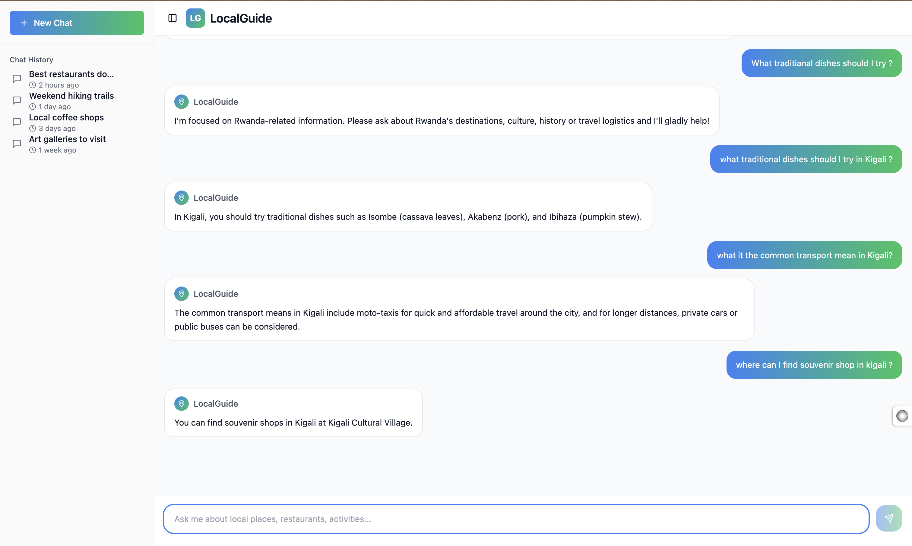
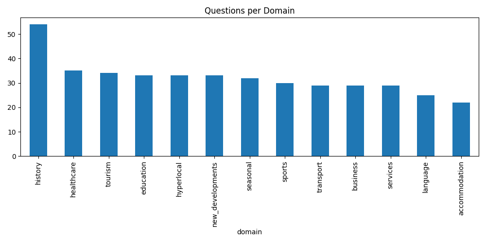

# Local-Guide Chatbot

## Overview

A full-stack application that lets users chat with a locally-trained Q&A model about tourism in Rwanda. It comprises a FastAPI backend that serves the model and a modern React (Vite + TypeScript + Tailwind CSS) frontend. Everything can be run locally with Python and Node, or packaged into a single container via Docker.

## Dataset

The dataset consists of manually curated and synthetically generated question-answer pairs focused on Rwanda-specific topics, Each entry consists of 3 columns:
domain: the query domain
question: The user query
answer: The relevant chatbot response

The final cleaned dataset comprises 430 unique question-answer pairs saved in `rwanda_qa_cleaned.csv`.



## Performance metrics

Perplexity: ~280.11, based on the tuned decoding evaluation (Trial 7). This reflects a significant improvement in fluency and confidence in T5-small’s domain-specific generative outputs.

Qualitative Evaluation: The model was tested using a Streamlit interface with realistic user queries, demonstrating:

In-domain accuracy (e.g., “eco-lodges near volcanoes np in rwanda” → “Bisate Lodge (luxury) or Red Rocks Rwanda (budget)”).

Out-of-domain rejection (e.g., “what’s the weather?” → “I'm sorry, I can only help with questions related to Rwanda's local services.”).

Training: The model was fine-tuned over 30 epochs (Trial 7) using a learning rate of 5e-5. It achieved a validation loss of 2.29, down from the baseline 3.65, showing a 37.3% reduction in loss, which indicates effective learning and improved generalization.

---

## ⚙️ Prerequisites

| Tool                 | Version (tested) | Notes                              |
| -------------------- | ---------------- | ---------------------------------- |
| Python               | 3.11             | Backend + training scripts         |
| uv (package manager) | 0.1+             | Lightning-fast dependency resolver |
| Node.js / npm        | 20 / 10          | Frontend dev & production build    |
| Docker (optional)    | 24+              | One-click containerised deployment |

Any later version _should_ also work.

---

## 🚀 Quick Start (local dev)

1. **Clone & install backend dependencies**

   ```bash
   git clone https://github.com/your-org/Local-guide-chatbot.git
   cd Local-guide-chatbot

   # Create & activate an isolated environment managed by uv
   uv venv .venv
   source .venv/bin/activate

   # Sync dependencies exactly as captured in uv.lock (blazing-fast)
   uv pip sync
   ```

2. **Install & run the frontend**

   ```bash
   cd frontend
   npm install   # or pnpm / bun
   npm run dev   # hot-reloads on http://localhost:5173
   ```

3. **Run backend**

```bash
uv run python main.py
```

---

## 🐳 Docker Deployment

The provided `Dockerfile` builds a production image that serves _both_ the compiled React front-end **and** the FastAPI backend in one container.

### Build

```bash
# From project root
docker build -t localguide-chatbot:latest .
```

---

## 🛠️ Useful Scripts

- `scripts/trainer.py` – Train / fine-tune the model headless (no notebook).
- `scripts/dataset_generator.py` – Augment data from raw sources.
- `scripts/preprocessing.py` – Text cleaning helpers shared across pipeline & trainer.

Run any script with `python -m scripts.trainer --help` for CLI options.

---

Made with ❤ By Me.
