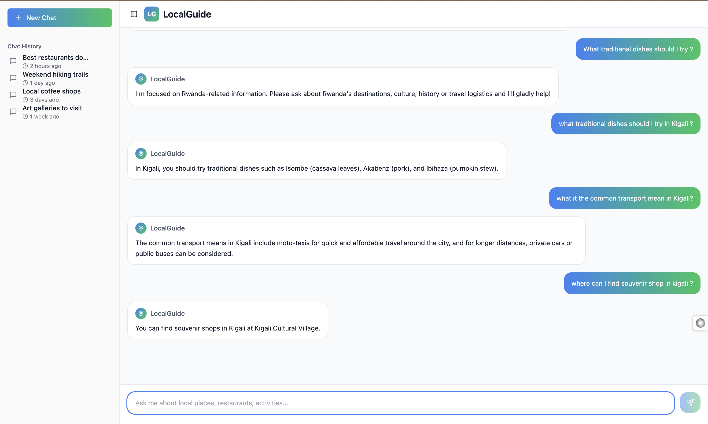

# Local-Guide Chatbot

## Overview

A full-stack application that lets users chat with a locally-trained Q&A model about tourism in Rwanda. It comprises a FastAPI backend that serves the model and a modern React (Vite + TypeScript + Tailwind CSS) frontend. Everything can be run locally with Python and Node, or packaged into a single container via Docker.

---

## 📂 Repository Structure

```
.
├── api/                  # FastAPI application (REST + Streaming endpoints)
│   ├── main.py           # Entrypoint for Uvicorn / Docker
│   ├── pipeline.py       # Inference & preprocessing pipeline
│   └── clean_data.py     # Utility script for dataset cleaning
│
├── frontend/             # React + Vite client application
│   ├── src/              # Front-end source (components, pages, hooks, ui)
│   └── public/           # Static assets served by Vite
│
├── notebook/
│   └── LocalGuideModel.ipynb  # Jupyter notebook used to train / fine-tune the model
│
├── scripts/              # Stand-alone Python helpers (training, preprocessing)
│   ├── dataset_generator.py
│   ├── preprocessing.py
│   └── trainer.py
│
├── rwanda_qa_cleaned.csv # Curated Q&A dataset (public)
│
├── Dockerfile            # Production-ready image combining backend & built frontend
├── pyproject.toml        # Poetry / PEP-621 project configuration
└── README.md             # You are here
```

> The tree above omits all files and directories ignored by Git (virtual-envs, caches, etc.).

---

## ⚙️ Prerequisites

| Tool                 | Version (tested) | Notes                              |
| -------------------- | ---------------- | ---------------------------------- |
| Python               | 3.11             | Backend + training scripts         |
| uv (package manager) | 0.1+             | Lightning-fast dependency resolver |
| Node.js / npm        | 20 / 10          | Frontend dev & production build    |
| Docker (optional)    | 24+              | One-click containerised deployment |

Any later version _should_ also work.

---

## 🚀 Quick Start (local dev)

1. **Clone & install backend dependencies**

   ```bash
   git clone https://github.com/your-org/Local-guide-chatbot.git
   cd Local-guide-chatbot

   # Create & activate an isolated environment managed by uv
   uv venv .venv
   source .venv/bin/activate

   # Sync dependencies exactly as captured in uv.lock (blazing-fast)
   uv pip sync
   ```

2. **Install & run the frontend**

   ```bash
   cd frontend
   npm install   # or pnpm / bun
   npm run dev   # hot-reloads on http://localhost:5173
   ```

---

## 🤖 Using / Retraining the Model

The conversational model powering the chatbot is prototyped in `notebook/LocalGuideModel.ipynb`.

1. Launch the notebook (e.g., `jupyter lab notebook/LocalGuideModel.ipynb`).
2. Execute the cells to download the base model, fine-tune on `rwanda_qa_cleaned.csv`, and export weights.
3. Exported checkpoints are automatically picked up by `api/pipeline.py`. By default the pipeline looks for a directory named `model` at the project root – simply move / copy your trained weights there.

_No external API keys are required – the entire model runs locally._

If you do not wish to retrain, you can download a pre-trained checkpoint (see project releases) and place it in the same `model/` folder.

---

## 🐳 Docker Deployment

The provided `Dockerfile` builds a production image that serves _both_ the compiled React front-end **and** the FastAPI backend in one container.

### Build

```bash
# From project root
docker build -t localguide-chatbot:latest .
```

---

## 🛠️ Useful Scripts

- `scripts/trainer.py` – Train / fine-tune the model headless (no notebook).
- `scripts/dataset_generator.py` – Augment data from raw sources.
- `scripts/preprocessing.py` – Text cleaning helpers shared across pipeline & trainer.

Run any script with `python -m scripts.trainer --help` for CLI options.

---

Made with ❤ By Me.
